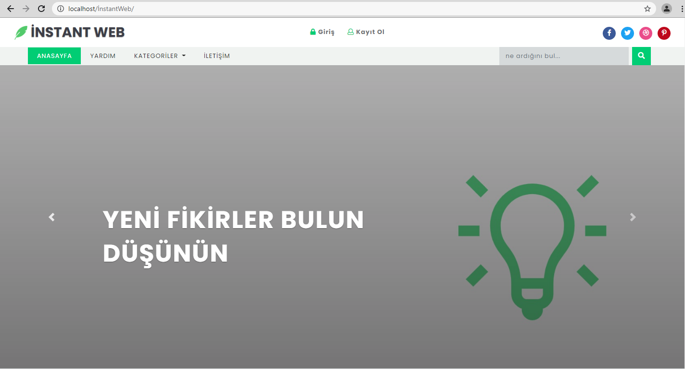

# InstantWeb

<ol>
        <li>Download xampp(version 7.3.27)<a href="https://downloadsapachefriends.global.ssl.fastly.net/7.3.27/xampp-windows-x64-7.3.27-0-VC15-installer.exe?from_af=true"> download</a></li>
        <li>Create a database named 'blog_admin_db' in phpMyAdmin</li>
        <li>Import the 'blog_admin_db.sql' file into the database you created</li> You can find this file in the 'InstantWeb\databasebackup' directory
        <li>Go to <a href="http://localhost/InstantWeb/"> localhost</a></li>
</ol>  
